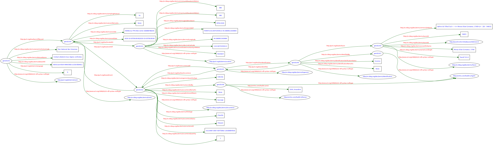

# Module Export

Module permettant d'ajouter des fonctionnalités globales et transversales d'export à l'application GeoNature.

## Fonctionnalités principales

- Interface administrateur de gestion des exports créés dynamiquement à partir de vues dans la base de données de GeoNature
- Interface utilisateur permettant de réaliser des exports sous forme de fichiers (CSV, JSON, GeoJSON, GeoPackage)
- API JSON d'interrogation dynamique et filtrable des exports
- Génération automatique planifiée des fichiers des exports
- Export sémantique RDF au format Darwin-SW


# Installation du module

## Configuration

### Paramètres
* ``export_dsw_dir`` : chemin absolu ou relatif au dossier media du dossier où l'export sémantique au format Darwin-SW sera réalisé
* ``export_dsw_filename`` : nom du fichier de l'export sémantique au format turtle (``.ttl``)
* ``expose_dsw_api`` : Indique si la route d'appel à l'API du Darwin SW est active ou non. Par défaut la route n'est pas activée.

Vous pouvez modifier la configuration du module en créant un fichier
`exports_config.toml` dans le dossier `config` de GeoNature, en vous inspirant
du fichier `exports_config.toml.example` et en surcouchant les paramètres que vous souhaitez.

Pour appliquer les modifications de la configuration du module, consultez
la [rubrique dédiée de la documentation de GeoNature](https://docs.geonature.fr/installation.html#module-config).

## Commande d'installation

- Téléchargez le module dans ``/home/<myuser>/``, en remplacant ``X.Y.Z`` par la version souhaitée

```bash
cd
wget https://github.com/PnX-SI/gn_module_export/archive/X.Y.Z.zip
unzip X.Y.Z.zip
rm X.Y.Z.zip
```

- Renommez le répertoire du module

```bash
mv ~/gn_module_export-X.Y.Z ~/gn_module_export
```

- Lancez l'installation du module

```bash
source ~/geonature/backend/venv/bin/activate
geonature install-gn-module ~/gn_module_export EXPORTS
sudo systemctl restart geonature
deactivate
```

## Mise à jour du module

- Suivez les éventuelles notes de la version que vous souhaitez installer

- Téléchargez la nouvelle version du module

```bash
wget https://github.com/PnX-SI/gn_module_export/archive/X.Y.Z.zip
unzip X.Y.Z.zip
rm X.Y.Z.zip
```

- Renommez l'ancien et le nouveau répertoire

```bash
mv ~/gn_module_export ~/gn_module_export_old
mv ~/gn_module_export-X.Y.Z ~/gn_module_export
```

- Si vous avez encore votre configuration du module dans le dossier `config` du module,
  copiez le vers le dossier de configuration centralisée de GeoNature :

```bash
cp ~/gn_module_export_old/config/conf_gn_module.toml  ~/geonature/config/exports_conf.toml
```

- Rapatriez aussi vos éventuelles surcouches des documentations Swagger des exports depuis le dossier `~/gn_module_export_old/backend/templates/swagger/`.

- Lancez la mise à jour du module

```bash
source ~/geonature/backend/venv/bin/activate
geonature install-gn-module ~/gn_module_export EXPORTS
sudo systemctl restart geonature
```

# Administration du module

## Création d'une nouvelle vue dans la BDD

Pour créer un nouvel export, il faut au préalable créer une vue dans la base de données correspondante à l'export souhaité.

Pour des questions de lisibilité, il est conseillé de créer la vue dans le schéma ``gn_exports``.

Par défaut, un export public (accessible à tous les utilisateurs ayant accès au module Export d'une instance GeoNature) est créé basé sur la vue ``gn_exports.v_synthese_sinp``, contenant toutes les données présentes dans la Synthèse. Il est possible de limiter les données dans cet exeport (en ajoutant des critères dans la clause WHERE de la vue ``gn_exports.v_synthese_sinp``), de supprimer cet export ou de le limiter à certains utilisateurs uniquement.

Les fichiers exportés sont automatiquement supprimés 15 jours après avoir été générés (durée configurable avec le paramètre ``nb_days_keep_file``).

## Enregistrer l'export créé dans le module Admin

L'interface d'administration est accessible dans GeoNature, dans le module ``Admin`` puis ``Backoffice GeoNature``.

Dans la rubrique "Exports", sélectionner le menu ``Export`` puis cliquer sur ``Create`` et renseigner les valeurs.

## Associer les roles ayant la permission d'accéder à cet export

Si l'export est défini comme "Public" (``gn_exports.t_exports.public = True``), alors tous les utilisateurs ayant accès au module pourront accéder à cet export. Sinon il est possible de définir les rôles (utilisateurs ou groupes) qui peuvent accéder à un export.

- R SCOPE 1 : J'accède au module, je vois et accède aux exports qui me sont associés ou à un groupe auquel j'appartiens.
- R SCOPE 3 : J'accède au module, je vois et accède à tous les exports
- C : Permet de créer des exports dans le module ADMIN (si j'ai accès à celui-ci)

# API JSON et documentation Swagger d'un export

Pour chaque export créé, une API JSON filtrable est automatiquement créée à l'adresse ``<URL_GeoNature>/api/exports/api/<id_export>``. Comme les exports fichiers, l'API JSON de chaque export est accessible à tous sans autorisation (si ``Public = True``) ou limitée à certains rôles (associés à l'export).

Si l'export est associé à certains rôles, ceux-ci peuvent accéder à l'API JSON de l'export grace à un token auto-généré pour chaque rôle associé à un export.
<URL_GEONATURE>/api/export/<ID_EXPORT>?token=xxxxxxxxx.

Il est aussi possible d'accéder à l'API en étant authentifié à GeoNature avec l'utilisateur ayant accès à l'export.

Il est également possible de passer le token via le header de la requête ("Authorization": "Bearer <token>").

Par défaut, une documentation Swagger est générée automatiquement pour chaque export à l'adresse ``<URL_GeoNature>/api/exports/swagger/<id_export>``, permettant de tester chaque API et d'identifier leurs filtres. Chaque champ est documenté automatiquement en affichant son commentaire défini dans la vue de l'export.

Il est possible de surcharger la documentation Swagger de chaque API en respectant certaines conventions :

1. Créer un fichier au format OpenAPI décrivant votre export
2. Sauvegarder le fichier ``~/gn_module_export/backend/templates/swagger/api_specification_{id_export}.json``

# Générer un export

Pour générer le fichier d’un export, une commande est disponible : `geonature exports generate <ID_EXPORT>`
Pour plus d’information sur l’utilisation de cette commande, lancer `geonature exports generate --help`.

# Export planifié

Il est possible d’automatiser la génération des fichiers des exports.
Ceci est configurable depuis la section "Planification des exports" dans le module Admin.

Les exports sont générés la nuit à 3 heures, selon la fréquence de génération configurée (en jours).

Vous pouvez forcer la génération d’un export manuellement avec la commande de génération `geonature exports generate`.

Par défaut, le fichier généré par un export planifié est disponible à l'adresse : ``<URL_GEONATURE>/api/media/exports/schedules/Nom_Export.Format``.

# URL des fichiers

Les fichiers servis par le serveur web Gunicorn sont soumis à un timeout pouvant interrompre le téléchargement des fichiers volumineux.
Il est donc conseillé de servir les fichiers des exports directement par Apache sans passer par Gunicorn.

Ainsi, il est recommandé d’utiliser la configuration Apache fourni par défaut dans GeoNature (``/etc/apache2/conf-available/geonature.conf``) qui sert les médias directement sans passer par Gunicorn.

# Export RDF au format sémantique Darwin-SW

Le module peut génèrer un export RDF au format Darwin-SW des données de la Synthèse de GeoNature.

Cet export est basé sur la vue ``gn_exports.v_exports_synthese_sinp_rdf`` dont il ne faut pas modifier la structure. Il est cependant possible d'en filtrer le contenu en y ajoutant des conditions dans un ``WHERE`` à la fin de la vue.

L'export est accessible de deux façons :

* API (si ``expose_dsw_api = true``)
* Fichier .ttl généré par une commande GeoNature

API :

  ``<URL_GEONATURE>/api/exports/semantic_dsw``

    Paramètres :
        - limit
        - offset
        - champs présents dans la vue ``v_exports_synthese_sinp_rdf``

Fichier .ttl, généré par la commande :

```bash
cd GN2_HOME
source backend/venv/bin/activate
geonature exports generate-dsw --limit 10 --offset=0
```

Le fichier est alors disponible à l'adresse <URL_GEONATURE>/api/media/exports/dsw/export_dsw.ttl.

Les paramètres ``limit`` et ``offset`` sont optionnels. S'ils ne sont pas spécifiés l'export se fera sur l'ensemble des données.

### Standard Darwin-SW

Le format Darwin-SW est un vocabulaire RDF conçu par le TDWG. Il repose sur le langage Web Ontology Language (OWL) qui est un langage de représentation des connaissances.

_"Darwin-SW (DSW) is an RDF vocabulary designed to complement the Biodiversity Information Standards (TDWG) Darwin Core Standard. DSW is based on a model derived from a community consensus about the relationships among the main Darwin Core classes. DSW creates two new classes to accommodate important aspects of its model that are not currently part of Darwin Core: a class of Individual Organisms and a class of Tokens, which are forms of evidence.  DSW uses Web Ontology Language (OWL) to make assertions about the classes in its model and to define object properties that are used to link instances of those classes. A goal in the creation of DSW was to facilitate consistent markup of biodiversity data so that RDF graphs created by different providers could be easily merged.  Accordingly, DSW provides a mechanism for testing whether its terms are being used in a manner consistent with its model. Two transitive object properties enable the creation of simple SPARQL queries that can be used to discover new information about linked resources whose metadata are generated by different providers. The Individual Organism class enables semantic linking of biodiversity resources to vocabularies outside of TDWG that deal with observations and ecological phenomena."_ (Source : http://www.semantic-web-journal.net/system/files/swj635.pdf)

Exemple de graphe représentant l'export d'une seule donnée de la synthèse selon le standard Darwin-SW avec un lien vers TAXREF-LD :



Bibliographie :

 * Darwin-SW : http://www.semantic-web-journal.net/system/files/swj635.pdf
 * Adding Biodiversity Datasets from Argentinian Patagonia to the Web of Data: http://ceur-ws.org/Vol-1933/paper-6.pdf
 * A Model to Represent Nomenclatural and Taxonomic Information as Linked Data. Application to the French Taxonomic Register, TAXREF : http://ceur-ws.org/Vol-1933/paper-3.pdf

# Autres

* CCTP de définition du projet : https://geonature.fr/documents/cctp/2017-10-CCTP-GeoNature-interoperabilite.pdf
* Biodiversité et opendata (Présentation d'Olivier Rovellotti au Forum TIC 2018) : https://geonature.fr/documents/2018-06-forum-tic-biodiversite-opendata-rovellotti.pdf
* Biodiversité et linked data (Présentation d'Amandine Sahl au Forum TIC 2018) : https://geonature.fr/documents/2018-06-forum-tic-biodiversite-linkeddata-sahl.pdf
* OPENDATA ET BIODIVERSITÉ (Pourquoi et comment publier ses données de biodiversité en opendata ?) : https://geonature.fr/documents/2019-04-biodiversite-opendata.pdf

A voir aussi :

* https://www.indigo-datacloud.eu
* https://fr.wikipedia.org/wiki/Syst%C3%A8me_d'information_taxonomique_int%C3%A9gr%C3%A9

Pour le volet Taxonomie, un travail expérimental a été réalisé : https://github.com/PnX-SI/TaxHub/issues/150
